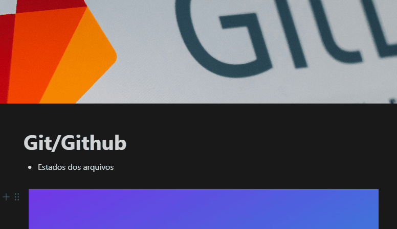

# Projeto de tabelas TESTE
Um projeto de teste com arquivo README❗

[](https://google.com)

## Tecnologias utilizadas
- HTML
- CSS
- JS

## Como utilizar

Clone o projeto
```
git clone
```

## O que aprendi

## Dificuldades ultrapassadas